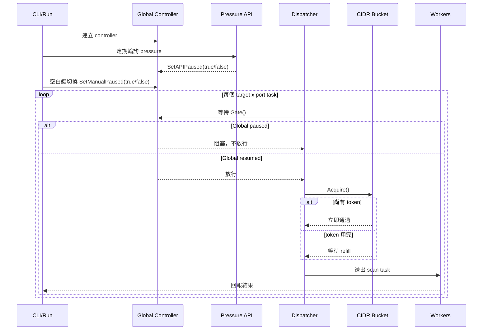

# Speed Control Explanation

本文件說明 `port-scan-mk3` 的兩層速度控制：

- `Global speed control`：全域暫停/恢復 gate
- `CIDR scan speed control`：每個 CIDR chunk 自己的 leaky bucket

對應圖檔：

- Mermaid 圖：本文件內文
- draw.io 圖：[speed-control-sequence.drawio](./speed-control-sequence.drawio)

## 1. 核心概念

目前實作把「控制速度」拆成兩層：

1. 全域層只決定 `dispatcher` 現在可不可以繼續送出新任務。
2. CIDR 層只決定某一個 CIDR chunk 送任務的節奏。

這兩層都發生在 task dispatch 階段，不會主動中止已經送進 worker 或已經開始做 TCP dial 的任務。

## 2. Global Speed Control

全域控制的核心在 `pkg/speedctrl/controller.go`。

- `Controller` 維護兩個 pause flag：
  - `apiPaused`
  - `manualPaused`
- 只要其中一個是 `true`，`Gate()` 就會阻塞。
- 兩個都為 `false` 時，`Gate()` 才會放行。

### 2.1 誰會改變 global gate

#### Manual pause

`pkg/speedctrl/keyboard.go` 會在 terminal raw mode 下讀鍵盤輸入。

- 按空白鍵一次：`manualPaused = true`
- 再按一次：`manualPaused = false`

`pkg/scanapp/pressure_monitor.go` 的 `startManualPauseMonitor` 只負責把狀態變化寫成 log。

#### API pause

`pkg/scanapp/pressure_monitor.go` 會定期 call `-pressure-api`。

- `pressure >= threshold` 時：`apiPaused = true`
- `pressure < threshold` 時：`apiPaused = false`

補充：

- CLI 可控制 polling 週期：`-pressure-interval`
- CLI 可完全關閉這層：`-disable-api=true`
- threshold 目前不是 CLI flag，runtime 預設值是 `90`
- API 若連續失敗 3 次，掃描會 fail fast 結束

### 2.2 Global gate 實際擋的是什麼

`pkg/scanapp/task_dispatcher.go` 在每次送 `scanTask` 前都會先等：

```go
select {
case <-ctx.Done():
    return ctx.Err()
case <-ctrl.Gate():
}
```

因此 global control 的效果是：

- 會停止送出新的 `scanTask`
- 不會取消已經在 worker 執行中的 task
- 不會回收已經進入 `taskCh` 的 task

所以它比較像「總閘門」，不是「每秒固定速率器」。

## 3. CIDR Scan Speed Control

CIDR 速度控制的核心在：

- `pkg/scanapp/scan.go`
- `pkg/ratelimit/leaky_bucket.go`

### 3.1 每個 CIDR chunk 都有自己的 bucket

建立 runtime 時，每個 `chunkRuntime` 都會建立一個自己的 bucket：

```go
bkt: ratelimit.NewLeakyBucket(cfg.BucketRate, cfg.BucketCapacity)
```

也就是說：

- `CIDR-A` 有自己的 bucket
- `CIDR-B` 有自己的 bucket

它們不是共用同一個 token pool。

### 3.2 bucket 怎麼運作

`LeakyBucket` 的規則如下：

- 啟動時先塞滿 `capacity` 個 token
- 每隔 `1/rate` 秒補 1 個 token
- `Acquire()` 成功拿到 token 才能送下一個 task

因此：

- `-bucket-capacity` 決定一開始能 burst 多大
- `-bucket-rate` 決定 burst 用完後，穩態每秒補幾個 task 配額

### 3.3 bucket 限制的是什麼單位

這裡限制的不是 IP 數，也不是 CIDR 數，而是：

- 一個 `target x port` = 一個 dispatch task

例如：

- 3 個 IP
- 2 個 port

總共就是 `3 x 2 = 6 tasks`。

bucket 限的是這 6 個 task 的送出節奏。

## 4. 簡單時序圖



## 5. 實際案例

### Case 1: 單一 CIDR，固定慢速

條件：

- 1 個 CIDR
- 2 個 IP
- 2 個 ports
- 共 4 tasks
- `-bucket-rate=2`
- `-bucket-capacity=1`
- `-delay=0`
- `-workers=10`

推導：

- 啟動時只有 1 個 token，所以第 1 個 task 立即送出
- 之後每 `0.5s` 才補 1 個 token
- 第 2、3、4 個 task 約在 `0.5s`、`1.0s`、`1.5s` 送出

結果：

- 這個 CIDR 的 dispatch 速度大致是 `2 tasks/sec`
- 幾乎沒有 burst

### Case 2: 單一 CIDR，先 burst 再回穩

條件：

- 1 個 CIDR
- 共 20 tasks
- `-bucket-rate=10`
- `-bucket-capacity=20`
- `-delay=0`
- `-workers=20`

推導：

- bucket 啟動時先有 20 個 token
- 20 個 task 幾乎都可以立刻 dispatch

結果：

- 一開始可以快速衝出 20 個 task
- burst 用完後，新的 dispatch 速度回到 `10 tasks/sec`

### Case 3: Global pause 介入

條件：

- `-pressure-interval=5s`
- pressure threshold 使用 runtime 預設 `90`
- API 某次回傳 `{"pressure":95}`

推導：

- 下一次 poll 時，controller 進入 paused
- dispatcher 卡在 `Gate()`
- 新 task 不再送出
- 但已在 worker 裡的 probe 繼續做完

若之後 API 回傳 `{"pressure":40}`：

- controller 恢復 open
- dispatcher 繼續送 task

### Case 4: 兩個 CIDR，不是 round-robin 公平分速

目前 `dispatchTasks()` 是照 `runtimes` 順序逐個 chunk dispatch。

如果：

- `CIDR-A` 有 100 tasks
- `CIDR-B` 有 100 tasks

目前比較接近：

1. 先 dispatch `CIDR-A`
2. `CIDR-A` 跑完或 dispatch 完
3. 再換 `CIDR-B`

因此目前設計的重點是：

- 每個 CIDR 有自己的 bucket

不是：

- 多個 CIDR 同時 round-robin 公平共享同一條全域速率

### Case 5: `-delay` 也會成為限速因子

條件：

- `-bucket-rate=100`
- `-bucket-capacity=100`
- `-delay=50ms`

推導：

- 就算 bucket 幾乎不構成限制
- dispatcher 每送 1 個 task 還是會固定 sleep `50ms`

結果：

- 單看 dispatcher，理論上最多約 `20 tasks/sec`

## 6. 精準推演版本

以下用這組參數做較精確的推導：

```bash
go run ./cmd/port-scan scan \
  -cidr-file cidr.csv \
  -port-file ports.csv \
  -bucket-rate 10 \
  -bucket-capacity 20 \
  -workers 5 \
  -delay 10ms
```

### 6.1 先列出所有控制因子

這組參數代表：

- bucket 穩態補 token 速度：`10 tasks/sec`
- bucket 初始 burst 容量：`20 tasks`
- dispatcher 固定送出間隔下限：`10ms/task`
- worker 數：`5`
- task channel 大小：`workers * 2 = 10`

### 6.2 若只看 dispatcher 本身

因為 `-delay=10ms`，dispatcher 即使完全不被別的因素卡住，理論上上限是：

- `1 / 0.01s = 100 tasks/sec`

所以 `delay` 本身不是這組參數的主要瓶頸。

### 6.3 若只看 bucket

bucket 啟動時有 20 個 token。

因此：

- 前 20 個 task 有資格立即通過 bucket
- 第 21 個 task 開始，要等 refill
- refill 速度是每 `100ms` 補 1 個 token

所以 bucket 的穩態上限是：

- `10 tasks/sec`

### 6.4 加入 workers 與 queue backpressure

實際 dispatch 還會受這兩個條件影響：

- 同時執行中的 worker 最多 `5`
- `taskCh` buffer 最多 `10`

因此在 target 反應偏慢時，系統最多大約只容納：

- `5` 個 in-flight
- `10` 個 queued
- 合計約 `15` 個已送出但尚未消化的 task

這表示：

- 雖然 bucket 有 `20` 個初始 token
- 但實際第一波可快速推出去的 task，常常會先被 worker + queue 容量卡在約 `15` 個左右
- 剩下 token 可能暫時留在 bucket，等 queue 騰出空位再繼續用

### 6.5 穩態速度公式

穩態吞吐量實際上接近下面幾個上限的最小值：

- bucket：`10 tasks/sec`
- delay：`100 tasks/sec`
- workers：`workers / 平均單個 task 完成秒數`

也就是：

```text
steady_state_tps ~= min(
  bucket_rate,
  1 / delay_seconds,
  workers / avg_task_seconds
)
```

### 6.6 兩個具體情境

#### 情境 A：目標很快

假設平均一個 probe `200ms` 完成。

worker 可提供的吞吐上限約為：

- `5 / 0.2 = 25 tasks/sec`

三者比較：

- bucket：`10/sec`
- delay：`100/sec`
- workers：`25/sec`

結果：

- 穩態瓶頸是 bucket
- 長時間平均速度約 `10 tasks/sec`

#### 情境 B：目標很慢

假設平均一個 probe `2s` 完成。

worker 可提供的吞吐上限約為：

- `5 / 2 = 2.5 tasks/sec`

三者比較：

- bucket：`10/sec`
- delay：`100/sec`
- workers：`2.5/sec`

結果：

- 穩態瓶頸改成 workers
- 長時間平均速度約 `2.5 tasks/sec`

### 6.7 這組參數的直觀結論

這組參數不是單純等於「每秒 10 個」；比較準確的說法是：

- bucket 允許一開始有最多 20 個 task 的 burst 配額
- 但實際第一波 burst 常先被 `5 workers + 10 queue` 卡住
- 之後長時間穩態速度，取決於 bucket、delay、workers/target latency 中最慢的那個

如果 target 普遍不慢，這組參數通常會表現成：

- 開頭一小段快速推進
- 然後落到約 `10 tasks/sec`

## 7. 程式碼對照

- Global controller: `pkg/speedctrl/controller.go`
- Keyboard manual pause: `pkg/speedctrl/keyboard.go`
- Pressure API pause: `pkg/scanapp/pressure_monitor.go`
- Dispatch gate + bucket acquire: `pkg/scanapp/task_dispatcher.go`
- Per-CIDR bucket 建立：`pkg/scanapp/scan.go`
- Bucket 實作：`pkg/ratelimit/leaky_bucket.go`
