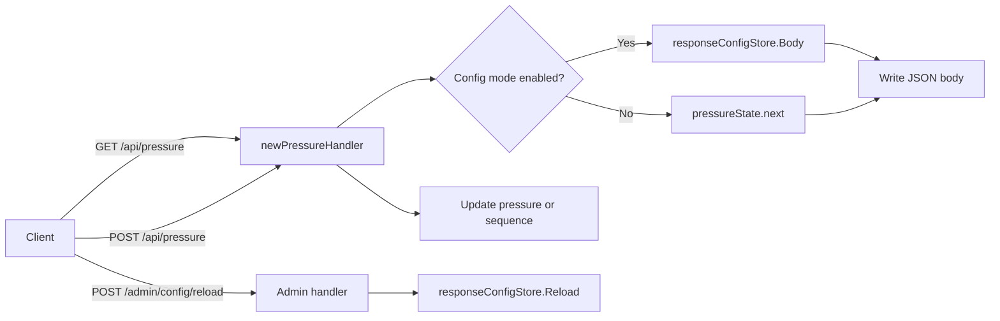

# Mock Pressure API Server Architecture

## Goals

- 可獨立啟動的 mock API server
- 可透過 config 檔控制 `/api/pressure` 的 response body
- 支援 runtime reload config（不重啟程序）
- 保留既有 simple/auth 行為，避免破壞原測試流程

## Components

1. `newPressureHandler`
- 對外提供 `/api/pressure`。
- `GET`：依序檢查 config-driven body（若啟用）或 numeric pressure state。
- `POST`：支援手動更新 pressure 或 sequence，便於 pause/resume 壓測。

2. `responseConfigStore`
- 負責載入與保存 `PRESSURE_RESPONSE_CONFIG` 對應 JSON。
- 提供 thread-safe `Body()` 與 `Reload()`。

3. Admin Endpoints
- `GET /admin/config`：查看目前載入的 body。
- `POST /admin/config/reload`：重讀 config 檔，立即生效。

4. Auth Endpoints（既有）
- `/auth`、`/data` 維持原本 OAuth-style 測試能力。

## Data Flow



## Config Schema

```json
{
  "response_body": {
    "pressure": 20
  }
}
```

`response_body` 可為任意合法 JSON（object 或 array）。

